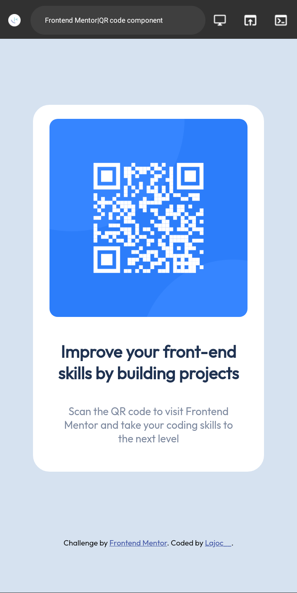

# QR-Code-Component
QR Code Component Challenge from Frontend Mentor

This is a solution to the [QR code component challenge on Frontend Mentor](https://www.frontendmentor.io/challenges/qr-code-component-iux_sIO_H). 

## Table of contents

- [Overview](#overview)
  - [Screenshot](#screenshot)
  - [Links](#links)
- [My process](#my-process)
  - [Built with](#built-with)
  - [What I learned](#what-i-learned)
  - [Continued development](#continued-development)
  - [Useful resources](#useful-resources)
- [Author](#author)
- [Acknowledgments](#acknowledgments)

## Overview

### Screenshot

### Links

- Solution URL: [Add solution URL here](https://your-solution-url.com)
- Live Site URL: [https://f-lajoc.github.io/QR-Code-Component/](https://f-lajoc.github.io/QR-Code-Component/)

## My process

I coded my layout with HTML using trebedit app on my mobile phone, then i used media query for the responsiveness on screen greater than 600px

### Built with

- Semantic HTML5 markup
- Mobile-first workflow
- Media Query

### What I learned

Through this project, i was able to learn and use media query.

### Continued development

I would like to delve into CSS Grid and Flex

### Useful resources

- [w3school media query](https://www.w3school.com) - This helped me in understanding media query.

## Author

- Frontend Mentor - [@lajoc__](https://www.frontendmentor.io/profile/lajoc__)
- Twitter - [@lajoc__](https://www.twitter.com/lajoc__)

## Acknowledgments

I appreciate w3school CSS course and random Google search resources that helped out.
